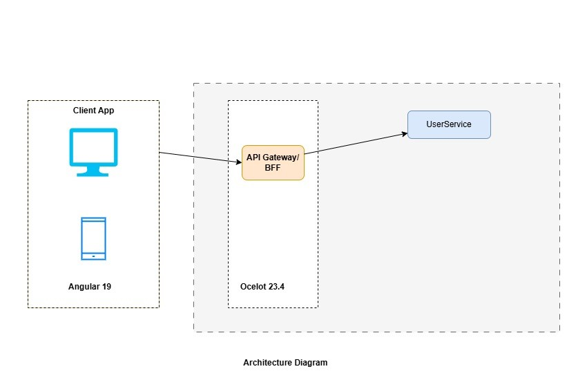

# user-onboarding-challenge

# Architecture


# Running the application.

1. go to frontend/web-app folder and run the following command to build the docker image.
```docker build -t dhruvsavaliya314/web-app:latest .```

2. go to root folder and run compose file to start the application.
```docker-compose up --build -d```


# API Documentation
1. Web: localhost:8080
2. API Endpoint: localhost:5013
3. REST Endpoint: localhost:5000